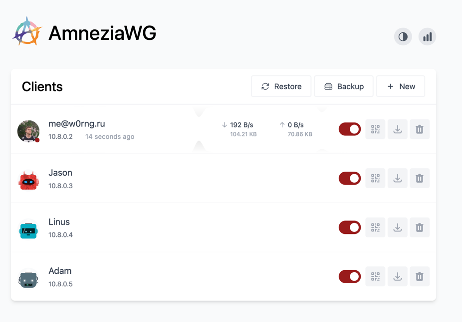

# AmneziaWG Easy

Упрощенный сервер WireGuard/AmneziaWG с Web UI, HTTPS и метриками.

<p align="center">
  
</p>

## Что умеет

- Управление клиентами WireGuard через Web UI.
- QR-коды и конфиги клиентов.
- One-time ссылки на конфиги.
- Истечение срока действия клиентов.
- UI-статистика трафика.
- Метрики для Prometheus/Zabbix.
- HTTPS с пользовательскими сертификатами.
- Поддержка AmneziaWG obfuscation-параметров (`JC`, `JMIN`, `JMAX`, `S1`, `S2`, `H1-H4`).

## Требования

- Linux сервер
- Docker + Docker Compose
- `/dev/net/tun`
- `NET_ADMIN`, `SYS_MODULE`

## Быстрый старт (локальный код)

```bash
cp .env_example .env
# отредактируйте .env (минимум: WG_HOST=...)
docker compose -f docker-compose.local.yml up -d --build
docker logs -f amnezia-wg-easy-local
```

Остановка:

```bash
docker compose -f docker-compose.local.yml down
```

Если видите предупреждение про orphan container, можно очистить:

```bash
docker compose -f docker-compose.local.yml up -d --remove-orphans
```

## Быстрый старт (готовый образ)

```bash
docker run -d \
  --name=amnezia-wg-easy \
  --env-file .env \
  -v ~/.amnezia-wg-easy:/etc/wireguard \
  -v /etc/letsencrypt:/etc/letsencrypt:ro \
  -p 51820:51820/udp \
  -p 51821:51821/tcp \
  --cap-add=NET_ADMIN \
  --cap-add=SYS_MODULE \
  --sysctl="net.ipv4.conf.all.src_valid_mark=1" \
  --sysctl="net.ipv4.ip_forward=1" \
  --device=/dev/net/tun:/dev/net/tun \
  --restart unless-stopped \
  ghcr.io/krolchonok/amnezia-wg-easy
```

## Конфигурация `.env`

- Шаблон: `.env_example`
- Полный список переменных: `ENV_VARIABLES.md`

Минимум для запуска:

```env
WG_HOST=your.public.ip.or.domain
```

Рекомендуется сразу добавить пароль админки:

```env
PASSWORD=your_strong_password
# или
# PASSWORD_HASH=$$2a$$12$$...
```

## WG_HOST=auto

Поддерживается значение:

```env
WG_HOST=auto
```

При старте сервис попытается определить внешний IP через:

1. `https://2ip.ru`
2. `https://ifconfig.me/ip` (fallback)

Если оба источника недоступны, контейнер завершится с ошибкой.

## HTTPS

Включение:

```env
SSL_ENABLED=true
SSL_CERT_PATH=/etc/letsencrypt/live/example.com/fullchain.pem
SSL_KEY_PATH=/etc/letsencrypt/live/example.com/privkey.pem
```

Важно:

- Сертификаты создаются вручную пользователем (например, через Let's Encrypt/reverse proxy или иным способом).
- Если сертификаты не найдены или невалидны, сервис запустится по HTTP.
- При одном открытом порте редирект `http -> https` сделать нельзя (нужен второй HTTP-порт или reverse proxy).

## Генерация паролей (`wgpw`)

Локальный образ:

```bash
docker build -t amnezia-wg-easy:local .
docker run --rm amnezia-wg-easy:local wgpw 'YOUR_PASSWORD'
```

Интерактивно:

```bash
docker run --rm -it amnezia-wg-easy:local wgpw
```

Формат вывода:

```text
ORIGINAL_PASSWORD='...'
PASSWORD_HASH='...'
PASSWORD_HASH_DOCKER_COMPOSE='$$2a$$...'
```

## Мониторинг

### Prometheus

```env
ENABLE_PROMETHEUS_METRICS=true
PROMETHEUS_METRICS_PASSWORD=metrics_plain_password
# или
# PROMETHEUS_METRICS_PASSWORD_HASH=$$2a$$12$$...
```

Эндпоинты:

- `/metrics`
- `/metrics/json`

Проверка:

```bash
curl -k -u anyuser:YOUR_PASSWORD https://<HOST>:<PORT>/metrics
```

### Zabbix

Можно опрашивать `HTTP agent`:

- `https://<HOST>:<PORT>/metrics`
- `https://<HOST>:<PORT>/metrics/json`

Для быстрого старта проще использовать `/metrics/json` + JSONPath preprocessing.

## Отладка

Смотрите логи контейнера:

```bash
docker logs -f amnezia-wg-easy-local
```

В логах есть расширенные SSL-сообщения:

- использованные `cert_path`/`key_path`
- найден ли файл
- старт HTTPS или fallback на HTTP

## Обновление

```bash
docker stop amnezia-wg-easy
docker rm amnezia-wg-easy
docker pull ghcr.io/krolchonok/amnezia-wg-easy
```

## Благодарности

- Основано на [wg-easy](https://github.com/wg-easy/wg-easy)
- Интеграция AmneziaWG: [amnezia-wg-easy](https://github.com/spcfox/amnezia-wg-easy)
